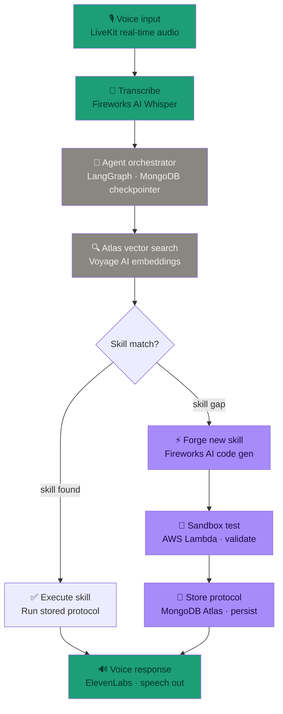
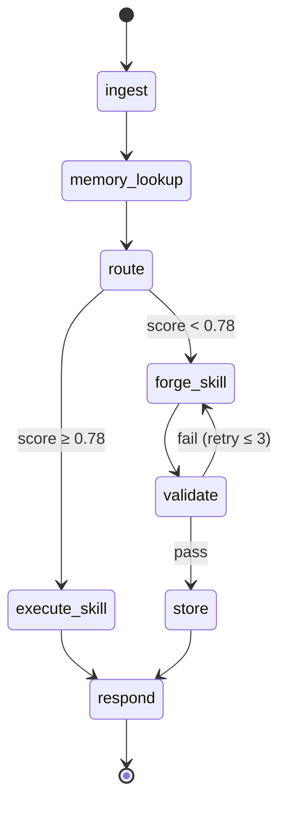
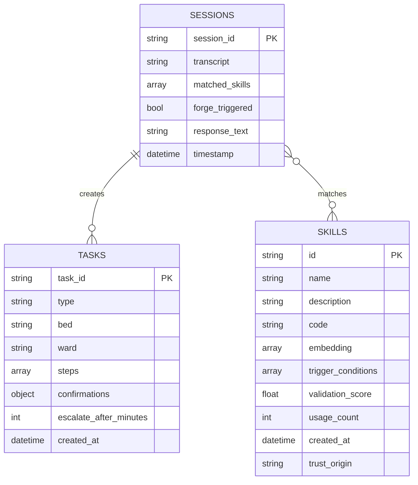
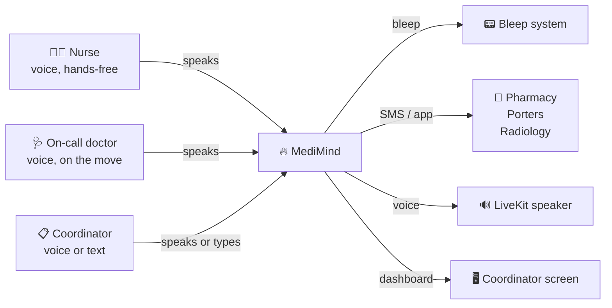

# MediMind — Agent Flow

## Full system flow



---

## What each node does

| Node | Service | What it actually does |
|---|---|---|
| Voice input | LiveKit | Opens a websocket, streams audio chunks from the clinician's mic in real time |
| Transcribe | Fireworks AI Whisper | Converts audio chunks to a transcript string, word-level timestamps |
| Agent orchestrator | LangGraph | State machine with 4 nodes: ingest → memory_lookup → route → respond. State persisted to MongoDB Atlas via LangSmith checkpointer — survives server restarts mid-shift |
| Atlas vector search | Voyage AI + MongoDB | Embeds the transcript, runs cosine similarity search against the skills collection. Returns top matches with scores |
| Skill match? | — | If best match score ≥ 0.78 → execute. If below → forge |
| Execute skill | — | Runs the stored Python coordination function. Sends notifications to the right people |
| Forge new skill | Fireworks AI | Generates a new Python coordination function from a structured prompt describing the gap |
| Sandbox test | AWS Lambda | Packages the forged function, runs it against 10 synthetic test cases stored in Atlas, scores outputs. Retries forge up to 3 times if score too low |
| Store protocol | MongoDB Atlas | Commits the validated function as a new skill document with Voyage AI embedding. Immediately available to all connected hospitals |
| Voice response | ElevenLabs | Converts response text to speech, streams back through LiveKit to the clinician |

---

## State machine detail



---

## MongoDB Atlas — data model



---

## Who communicates with MediMind



---

## The forge pipeline (detail)

```
Transcript: "Patient in bed 6 needs emergency inter-site transfer
             with equipment, records, transport, and receiving
             bed confirmation — all simultaneously"
        │
        ▼
Atlas search: no match above threshold
        │
        ▼
Forge prompt to Fireworks AI:
  "Given this gap: [description]
   Write a Python async function that coordinates:
   - Ambulance transport booking
   - Receiving hospital notification
   - Medical records transfer
   - Next-of-kin contact
   - Bed confirmation at destination
   Return only valid Python. No explanations."
        │
        ▼
Fireworks returns: def coordinate_inter_site_transfer(patient_id, destination): ...
        │
        ▼
AWS Lambda: run against 10 synthetic patient transfer cases
  Score: 0.91 ✓
        │
        ▼
MongoDB Atlas: new document written
  id: "PT-0001"
  available to all connected NHS trusts immediately
        │
        ▼
ElevenLabs speaks:
  "No existing protocol for this transfer type.
   I've built and validated a new coordination workflow.
   Initiating now — ambulance, UCLH, records, and
   next-of-kin all contacted simultaneously."
```

---

## Always-on architecture

MediMind runs as a persistent process across the entire 12-hour hospital shift.

- **NemoClaw** keeps the agent alive with a single command, handling restarts automatically
- **MongoDB Atlas checkpointer** (via LangSmith) saves full agent state after every node — if the process crashes at step 3 of a 5-step coordination, it resumes from step 3
- **LangGraph** state machine recovers from partial failures without replaying completed steps
- **AWS Lambda** is stateless — forge validation is idempotent, safe to retry

The system starts the shift with however many protocols are in Atlas. It ends the shift with more. Every novel situation it handles becomes a permanent capability.
